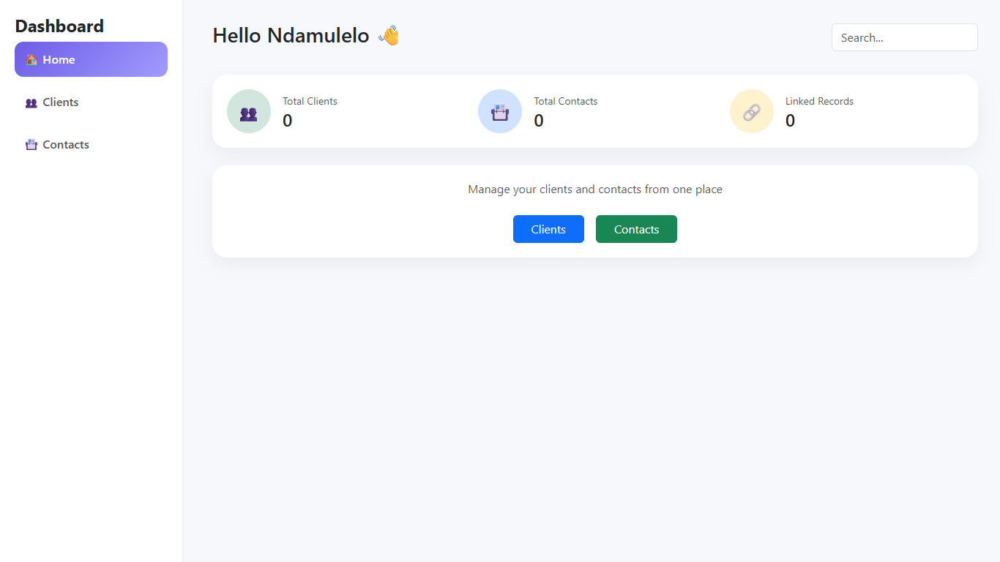
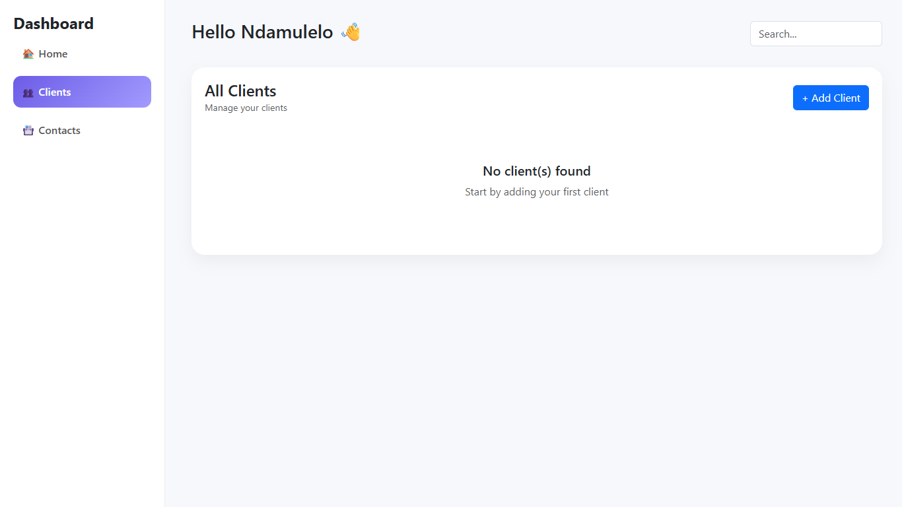
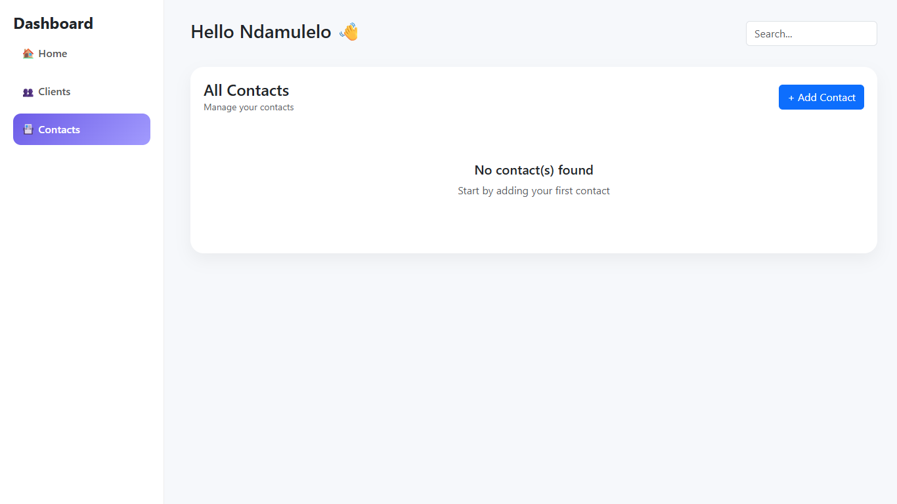
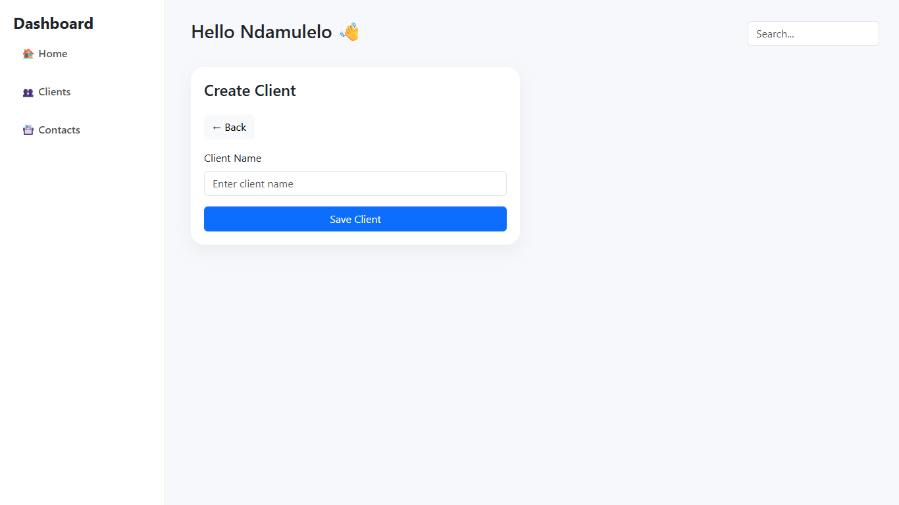
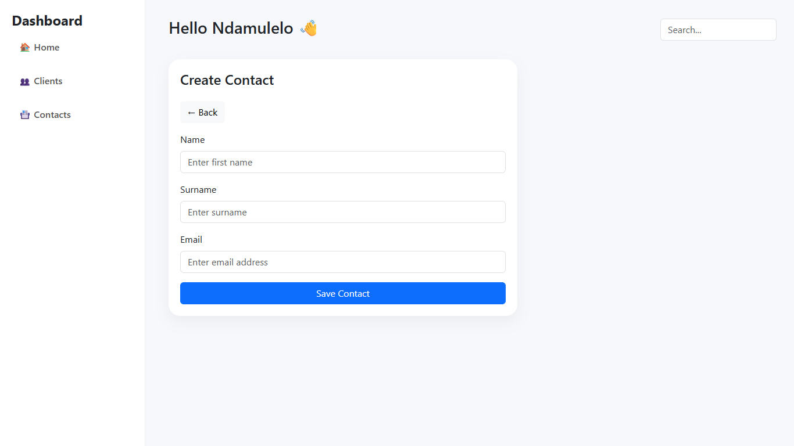
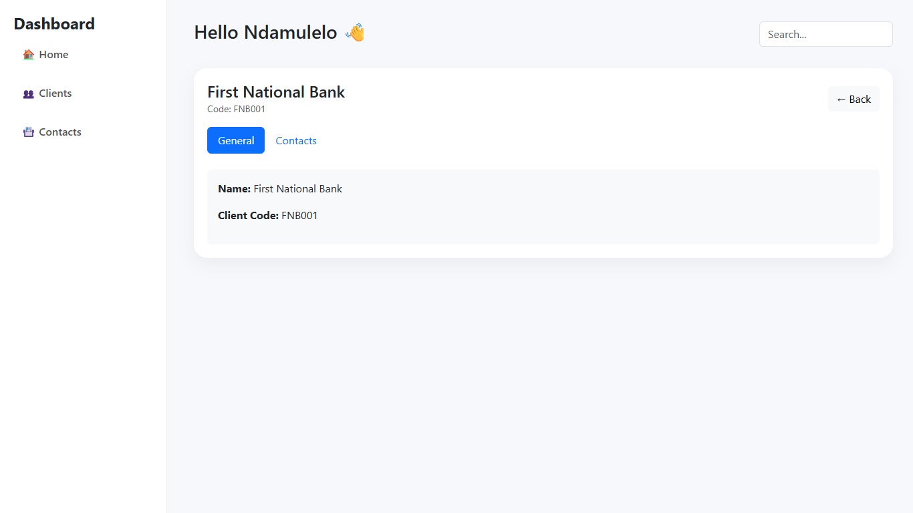
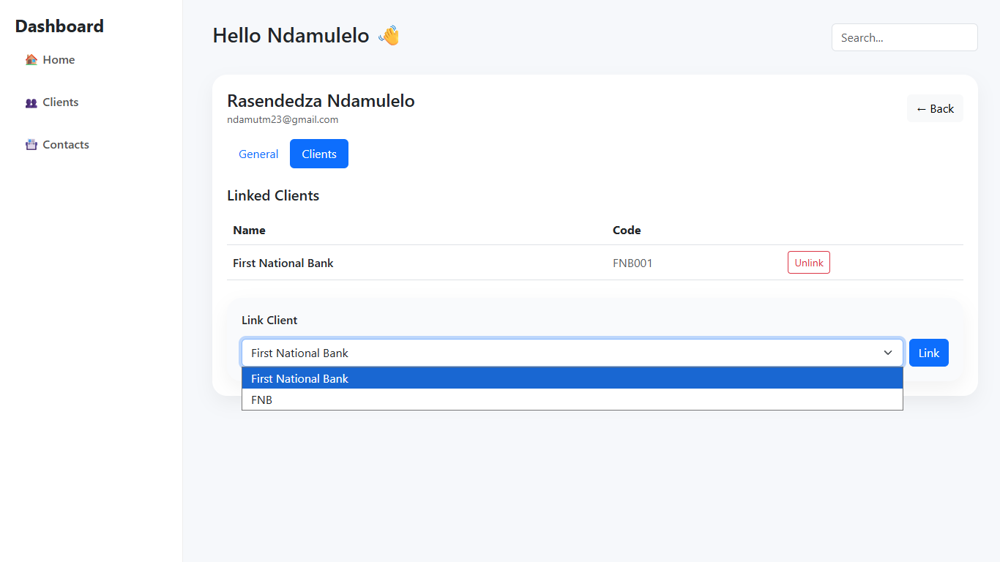
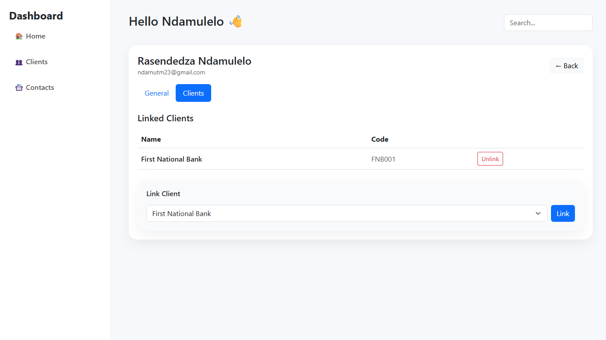
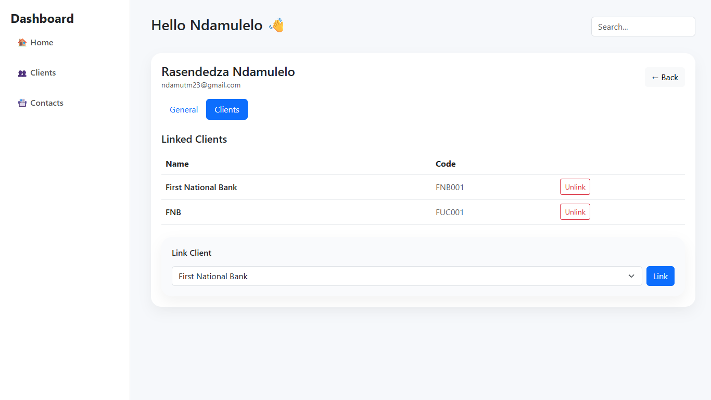
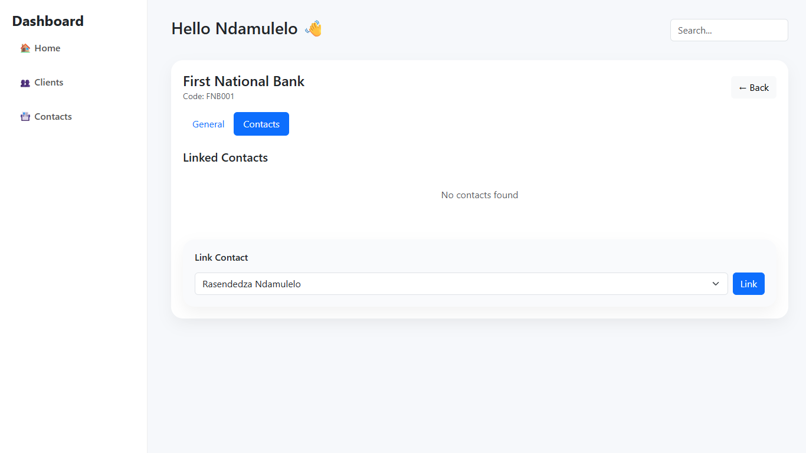

# 🚀 Client Contact Management System (CCMS)

> *"Simple. Clean. Powerful. And yeah… it actually works."* 😌

---

## 📌 Overview

So this project is basically a **Client Contact Management System (CCMS)** that I built using **pure PHP (no frameworks because... why not make life harder for myself 😤)**.

What it does:

* Manage **clients**
* Manage **contacts** 
* Link clients ↔ contacts (**many-to-many relationship** 🔥)
* View relationships in a way that doesn't hurt your eyes
* Navigate through a dashboard UI that I'm actually pretty proud of

👉 Think of it like a **mini CRM system** — but I built it from scratch because frameworks are for people who don't like pain lol

---

## 🎨 Design

Okay so I didn't just code this thing... I actually redesigned the whole UI too because the original inspiration was cool but I wanted to make it *mine* 😎

* 🔥 **My Redesigned Version (check it out):**
  [https://www.figma.com/design/mBXv1UegFgsnPr7PD6cFIk/CCMS-REMADE?node-id=0-1&t=b6xYJQslQSdRbRqh-1](https://www.figma.com/design/mBXv1UegFgsnPr7PD6cFIk/CCMS-REMADE?node-id=0-1&t=b6xYJQslQSdRbRqh-1)

* 🎯 **Original Design (where I got the idea):**
  [https://www.figma.com/design/XYbwK3c6Bz3QB7AlofNam8/CRM-Dashboard-Customers-List--Community-?node-id=501-2&t=UQVERxeUJ5KkeSQ7-1](https://www.figma.com/design/XYbwK3c6Bz3QB7AlofNam8/CRM-Dashboard-Customers-List--Community-?node-id=501-2&t=UQVERxeUJ5KkeSQ7-1)

> I basically took the original concept and made it cleaner with more of that modern SaaS dashboard vibe. You know, the kind that makes you feel professional even when you're coding in your pajamas.

---

## 🧠 What This App Actually Does (Explain Like I'm 5 🍼)

Alright so imagine:

* You have **people (contacts)** - like John, Sarah, etc.
* You have **companies/clients** - like Google, Microsoft, whatever
* A person can work with multiple companies
* A company can have multiple people working with them

So I built a system to **keep track of all these connections**

👉 It's kinda like linking your friends to different group chats - same concept

---

## 📸 Screenshots

### 🏠 Dashboard


---

### 👥 Clients (No Clients State)


---

### 📇 Contacts (No Contacts State)


---

### ➕ Create Client


---

### ➕ Create Contact


---

### 🏢 Client View (FNB Example)


---

### 🔗 Linking Contacts to Client


---

### 🔗 Linked Contacts Example


---

### 🔗 Multiple Links Example


---

### 🚫 No Links State


---

> *Yes… it actually works like this in real life 😌*
---

## 🌐 Live Demo

The application is deployed and accessible here:

👉 https://bc-ccms.nfutr.co.za/

> Fully functional, real-time application (not just screenshots)
---

## ⚙️ Tech Stack

### 🛠 Tools I Used

* VS Code – Where the magic (and bugs) happen 💻
* GitHub – So I don't lose my work when my laptop decides to die
* XAMPP – Apache + MySQL because local development >>> everything
* Live Server – For that instant preview dopamine hit
* Prettier – Because nobody wants to look at ugly code (including future me)

### 🤖 AI Assistance (Being Honest Here)

* GitHub Copilot – Helped with code completion & some debugging

> ⚠️ **Real Talk:**
> I used AI for:
>
> * Autocompleting repetitive stuff
> * Helping me debug when I was stuck at 2am
> * Suggesting optimizations
>
> What I DIDN'T do: Just copy-paste AI-generated features. That's cheating and you learn nothing.
> All the actual logic and architecture? That's me struggling through it 😅

---

### 💻 Languages

* PHP - the main character here
* HTML - structure (obviously)
* CSS - making things not look like they're from 1999
* JavaScript - for those smooth interactions

---

### 🎨 Design

* Figma - where I pretended to be a designer for a few hours

---

## 🏗 Architecture

I tried to follow something like an **MVC structure** (emphasis on "tried" lol):

```
/models
  Client.php         // Client data stuff
  Contact.php        // Contact data stuff  
  ClientContact.php  // The linking magic

/controllers
  ClientController.php   // Handles client operations
  ContactController.php  // Handles contact operations

/views
  /clients    // All the client pages
  /contacts   // All the contact pages
```

It's not perfect MVC but hey, it works and it's organized 🤷‍♂️

---

## 🗄 Database Design

Pretty straightforward - we've got **3 tables**:

### 1. `clients`

```sql
id | name | client_code
```

### 2. `contacts`

```sql
id | name | surname | email
```

### 3. `client_contact` (the join table - this is where the relationship magic happens)

```sql
client_id | contact_id
```

👉 This setup allows for **many-to-many relationships** which sounds fancy but it's just saying "one contact can belong to many clients and vice versa"

---

## 🔥 Key Features (The Cool Stuff)

### ✅ Client Management

* Create new clients
* Auto-generate unique client codes (more on this below because I'm proud of it)
* View all your clients in one place
* See how many contacts each client has

---

### ✅ Contact Management

* Add new contacts
* Email validation + uniqueness checking (no duplicates allowed!)
* View all contacts
* See how many clients each contact is linked to

---

### 🔗 Linking System (THIS IS THE MAIN EVENT 💥)

* Link contacts to clients from either side
* Unlink them whenever you want
* It just... works. Which honestly surprised me the first time.

---

### 📊 Dashboard

Shows you:
* Total Clients
* Total Contacts  
* Total Links
* Has these animated counters that count up when you load the page (unnecessary but looks cool 😎)

---

### 🎯 Routing System (No Ugly `.php` Extensions 😤)

Nobody wants URLs like:
```
clients.php
contacts.php
```

So I made them clean:
```
/clients
/contacts
/client_show?id=1
```

Handled through some routing logic:

```php
$page = $_GET['page'] ?? 'home';  // Gets the page or defaults to home
```

Not the most sophisticated routing but it gets the job done

---

## 🚀 How to Run This Thing

1. Download and install **XAMPP** (if you don't have it already)

2. Move the whole project folder to:

```
C:/xampp/htdocs/     // Windows
/Applications/XAMPP/htdocs/   // Mac
```

3. Start these services in XAMPP:

* Apache ✅
* MySQL ✅

4. Open your browser and go to:

```
http://localhost/your-project-folder-name
```

5. Import the database (should have a .sql file somewhere... I hope 😅)

---

## 🧪 Example Code (The Nerdy Part)

### 🔥 Client Code Generator Logic

This was actually fun to figure out. Here's how I auto-generate client codes:

```php
// Take first 3 letters of company name and make them uppercase
$prefix = strtoupper(substr($name, 0, 3));

// Get the current count and pad it with zeros to make it 3 digits
$number = str_pad($count, 3, '0', STR_PAD_LEFT);

// Combine them
$clientCode = $prefix . $number;
```

👉 Real examples:

* "First National Bank" → `FNB001`
* "IT Solutions" → `ITS001`  
* "A" → `A001` (edge case I had to handle)

Pretty neat right? Each client gets a unique code automatically.

---

## 😅 Challenges I Faced (The Struggle Was Real)

* **Routing without `.php`** - Took way longer than it should have. Fun pain.
* **Many-to-many linking logic** - My brain hurt figuring out the join table queries
* **Keeping UI clean while dealing with backend** - Switching contexts is hard
* **Tab switching functionality** - Was broken initially and I spent 2 hours debugging it. Turned out to be a missing event listener. Classic. 😭
* **Client code generation** - Edge cases with short names and ensuring uniqueness

---

## 🧠 What I Actually Learned

* MVC architecture (not just the theory - actually implementing it)
* How database relationships really work in practice
* Building a routing system from scratch
* Integrating frontend and backend properly
* SQL joins (specifically for many-to-many relationships)
* That debugging at 2am is never a good idea but I'll keep doing it anyway
* How to write cleaner, more maintainable code

---

## 💬 Final Thoughts

On the surface this looks like a **simple CRUD app...**

But when you dig into it:

👉 It handles complex many-to-many relationships
👉 Uses proper separation of concerns with MVC
👉 Has real-world business logic
👉 Clean, modern UI that doesn't look like a school project
👉 Actually works in production (tested it!)

Could I have used Laravel or some framework? Sure.
Would it have been easier? Probably.
Did I learn more by doing it from scratch? Absolutely. 💯

---

## 🧑‍💻 Author

**Ndamulelo**

> "I'm not the first to do it nor the last to do it, but I'll be the best to ever do it." 😤🔥

(Confidence is key, right? 😏)

---

## ⭐ Bonus Section

If you actually read this far...

👉 Yes, I built this from scratch with my own hands (and brain)
👉 Yes, it actually works (not just screenshots)
👉 Yes, the code is relatively clean (I went back and refactored a few times)
👉 Yes, I'm proud of it

And most importantly...
👉 This is just the beginning. I've got bigger projects brewing 😏

---

### TODO (Things I might add if I revisit this):

- [ ] Search functionality
- [ ] Export to CSV
- [ ] Email notifications
- [ ] User authentication (currently anyone can access everything lol)
- [ ] Dark mode (because why not)
- [ ] Better error handling
- [ ] API endpoints (maybe?)

---

*Last updated: Whenever I finished this README (probably late at night)*

*Typos: Definitely some, but they add character* 😎

---

## 📩 Assessment Context

This project was completed as part of a **software developer assessment**.